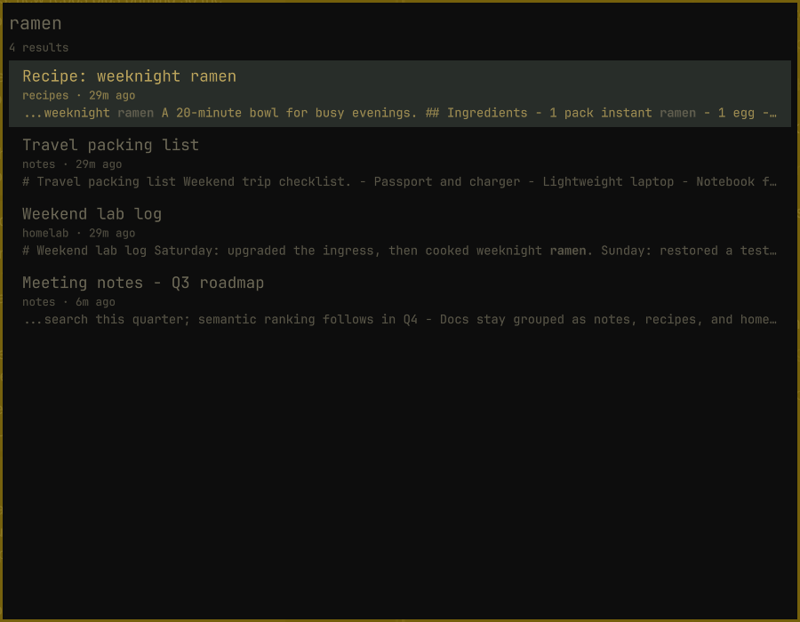
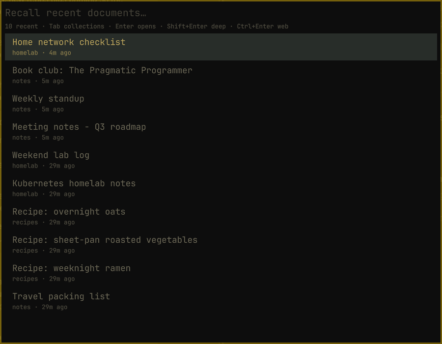
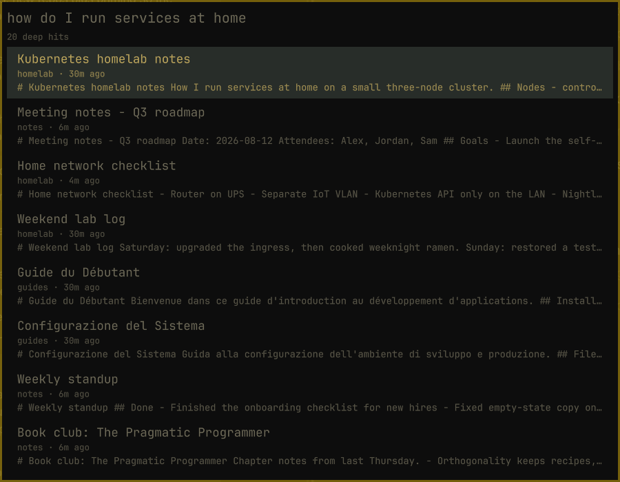
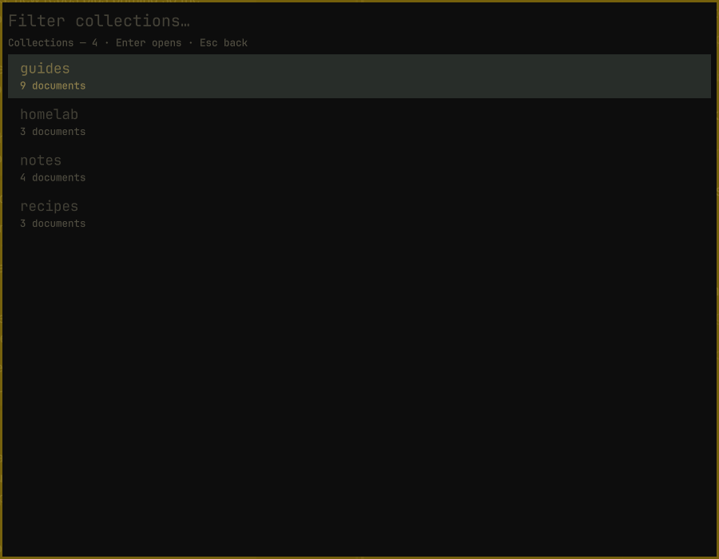
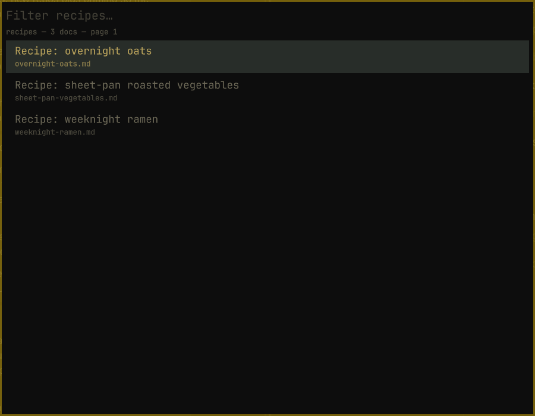
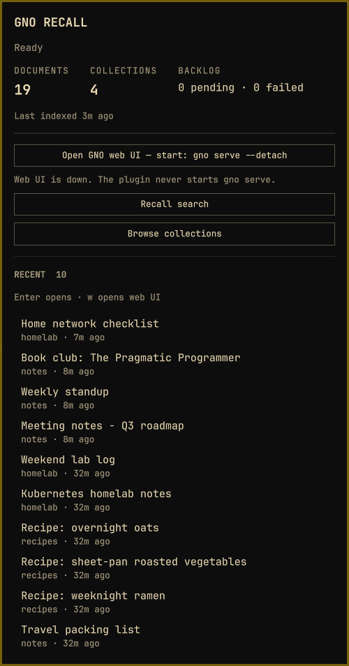

# GNO Recall

[GNO](https://gno.sh) is an open source local-first knowledge engine. It indexes notes, documents, and code into collections and searches them with BM25 keyword, semantic, and hybrid retrieval, plus Q&A, through a CLI, an MCP server, a REST API, and a web UI. Indexing and search run on your machine with local GGUF models, with no cloud backend and no telemetry.

This [Omarchy](https://omarchy.org/) plugin surfaces that index from the bar. The bar widget is quiet when the index is healthy (a history glyph only) and adds a distinct shape plus color when there is backlog, staleness, or a setup/degraded fault. Left-click opens an anchored index panel; Super+R (after the optional keybind script) or `omarchy-shell shell toggle gmickel.gno-recall` summons the recall overlay.



## Screenshots

| | |
|---|---|
|  Overlay: recent documents |  Overlay: Shift+Enter deep search |
|  Overlay: browse collections |  Overlay: documents in a collection |
|  Panel: health, counts, recents |  Bar widget (history glyph), quiet when healthy |

All screenshots show a demo index.

## Requirements

- Omarchy with shell plugin support
- Linux x86_64 with glibc (Omarchy); system Python 3.11+ and bash
- The **verified Recall runtime**: GNO **2.2.1**, Bun **1.4.2** and pinned dependencies, installed explicitly below. CPU, CUDA and Vulkan native packages are included; compatible system GPU drivers remain required. Other architectures and musl are not currently supported.
- A Nerd Font (Omarchy includes one by default)

`gno peek --json` is the snapshot path. Peek `serve.running` is true only for
`gno serve --detach`. A foreground serve is not detected. Overlay search is a
second argv-array call: `gno search --query-file <runtime-file> --json --no-project-affinity -n 20`
(BM25; the query is written to a 0600 file under `XDG_RUNTIME_DIR` and is never on argv). Shift+Enter runs hybrid `gno query --query-file <runtime-file> --json --no-project-affinity -n 20`
at balanced depth (embeddings + expansion + rerank, 90s timeout, no `--depth`
flag). Collection browse uses `gno status --json` (collections list) and
`gno ls <collection> --json -n 50 --offset <n>` (paginated documents). The pinned runtime provides the `peek@1.0` schema,
Web UI `/doc?uri=` deep links and `source.absPath` on search hits. The plugin
never calls `gno get` or starts a server.

## Privilege boundary

Plugins run as **unsandboxed code inside `omarchy-shell`**. Adding a plugin clones files and toggles enabled state; it does not sandbox the QML. Only install repos you are willing to run in the long-lived shell process.

The Omarchy plugin installer **never runs hooks**. `omarchy plugin add` only clones files and toggles enabled state; it never runs plugin code. Super+R is a documented post-add script you run yourself (`scripts/install-keybind.sh`).

## Install

```bash
omarchy plugin add https://github.com/gmickel/omarchy-gno-recall --enable
```

Install the dedicated backend from the installed plugin checkout (about 1.3 GiB unpacked; network access required):

```bash
cd ~/.config/omarchy/plugins/gmickel.gno-recall
./scripts/install-runtime.sh
```

This downloads only the exact hash-locked release artifacts in `runtime/trust-manifest.json`, verifies them before extraction, applies the reviewed hash-guarded runtime fixes, and runs no package install scripts. It installs below `${XDG_DATA_HOME:-~/.local/share}/gno-recall/runtimes/`. Global Bun and GNO are not used. Every backend invocation verifies the installed tree before execution; missing, changed or additional files fail closed. Middle-click the widget to refresh after installation.

The backend uses your existing GNO config, data and model-cache locations. For a new index, use `./scripts/verified-gno.sh init /absolute/path/to/notes --name notes`, then `./scripts/verified-gno.sh index`. You can use the same launcher for other GNO CLI commands. The plugin itself never indexes documents or starts a server.

The widget lands on the right side of the bar. The overlay is summonable immediately over IPC; Super+R is optional and is **not** installed by `plugin add`.

```bash
# From a checkout, after the plugin is added:
./scripts/install-keybind.sh
```

Move the widget with:

```bash
omarchy bar move gmickel.gno-recall --section right
```

### Update

```bash
omarchy plugin update gmickel.gno-recall
```

Then run the installed checkout's `./scripts/install-runtime.sh` again and refresh Recall. If the trusted manifest changed, the plugin refuses the old runtime until the matching one is installed. Existing runtimes and GNO documents/config/data/models are retained; a global GNO/Bun upgrade does not upgrade Recall.

**Shared index compatibility:** a newer global GNO can change an index schema beyond the bundled version. Check compatibility and back up your index before upgrading either writer. Do not downgrade an index by switching binaries; use a reviewed compatible Recall release or a separate index. See [maintainer upgrade and rollback procedure](docs/MAINTAINING.md).

Or update every git-managed plugin:

```bash
omarchy plugin update
```

### Integrity failure / interrupted installation

Run `./scripts/install-runtime.sh --repair` from the installed plugin checkout, then refresh. A verified replacement is staged before replacing an altered runtime. The previous tree is retained with a `.quarantine-<pid>` suffix for inspection. Download failures leave the previous installation intact. Never fix an integrity error by changing hashes or pointing Recall at a global executable.

### Remove

```bash
omarchy plugin remove gmickel.gno-recall
```

Removing the plugin leaves its dedicated runtimes and your GNO index/models intact. After removal, you may delete only `${XDG_DATA_HOME:-~/.local/share}/gno-recall/runtimes/` to reclaim runtime disk space; keep old versions while rollback is needed. Do not remove the separate `gno` data/config/cache directories unless you intend to remove your index too.

## Settings

| Setting | Default | Meaning |
| --- | --- | --- |
| Refresh interval (`refreshIntervalSec`) | 900 | Coarse poll interval in seconds (60–3600). |

```bash
omarchy bar set gmickel.gno-recall refreshIntervalSec 900
```

The trust boundary includes the reviewed plugin checkout and the host OS (Python, bash, libraries and GPU drivers). Runtime verification is not a sandbox or protection against a compromised user account changing the verifier. Model files and index/document data are separate from the pinned executable runtime. See [the verification design](docs/MAINTAINING.md).

## Local development

From a checkout of this repo:

```bash
./scripts/install-runtime.sh
python3 scripts/test-runtime.py
python3 scripts/smoke-runtime.py
omarchy plugin validate .
qmllint -I "$OMARCHY_PATH/shell" Service.qml BarWidget.qml Panel.qml RecallOverlay.qml
omarchy plugin add "$PWD" --enable
./scripts/install-keybind.sh   # optional; skipped automatically if SUPER+R is taken
```

`OMARCHY_PATH` is typically `/usr/share/omarchy`. After add, the live copy is `~/.config/omarchy/plugins/gmickel.gno-recall`. The shell hot-reloads QML under that directory; `omarchy-shell shell rescanPlugins` forces a reload.

`qmllint` may report Quickshell-module false positives (`Quickshell.Io.Process`, `SplitParser`, `PanelWindow`) because those types come from the Quickshell runtime, not the Omarchy import path. Treat those as noise unless they point at real syntax errors.

## Cache and privacy

The last-good peek snapshot (titles, paths, snippets, and the last successful search list) lives **only in memory** on the `Service.qml` object, as do the collections list from `gno status` and any paginated `gno ls` page. Nothing is written to XDG state, `Qt.labs.settings`, or a FileView. A Quickshell restart (`omarchy restart shell`) drops the cache; the bar shows a loading/empty state until the next `gno peek` succeeds. When a refresh fails, surfaces keep the last-good rows and show a visible cache age from `lastSuccessfulRefreshAt` (for example `Showing last good · 2m ago`).

## How it works

`Service.qml` is the only `Process` owner. It always uses `scripts/verified-gno.sh`; legacy `gnoPath` settings are ignored. After runtime verification, it invokes `gno peek --json` as an argv array via `Quickshell.Io.Process` + `SplitParser` (empty `splitMarker`, raw-chunk accumulation with a 512KiB kill bound). Bar and overlay surfaces look the service up with `bar.shell.serviceFor("gmickel.gno-recall")` — third-party plugins must not use `firstPartyServiceFor`.

The overlay is the summonable surface (`omarchy-shell shell toggle gmickel.gno-recall`). It opens on the focused monitor, grabs exclusive keyboard focus, and shows cached peek `recent[]` immediately. Typing filters titles and URI tails in memory. There is no `gno` subprocess per keystroke. Enter on a typed query runs BM25 `gno search` through `Service.qml`. Runtime verification and startup took about 1.5s warm and 2.4s with cold file-cache hints on the development machine; disk and hardware affect this. Shift+Enter runs hybrid `gno query` at balanced depth with a 90s timeout. The overlay shows `Deep searching… (embeddings + rerank)`, then `N deep hits`. A new Enter, Shift+Enter, Esc, or a query change cancels the in-flight Process. One shared search generation id drops late JSON, so a late deep result cannot clobber a newer fast search.

**Browse collections** is a second overlay mode. From recents, **Tab** (or **Ctrl+B**) lists every collection from `gno status --json` (name + document count). Enter drills into a paginated `gno ls` document list (50 per page). A **Load more…** row (Enter, Right, or Page Down at the end) appends the next offset. Typing still filters in memory only — collection names on the list, already-loaded document titles/paths inside a collection. Esc walks back one step at a time: clear filter → documents back to collections → collections back to recents → dismiss via `shell.hide`. Backspace with an empty filter also steps back a browse level without dismissing.

`omarchy-shell shell summon gmickel.gno-recall '{"mode":"collections"}'` opens the overlay directly on the collections list. The panel **Browse collections** action uses that payload.

Rows show title (URI-tail fallback), collection (peek field for recents, `gno://<collection>/…` for search hits, `source.relPath` for browsed documents), snippet, and modified time. GNO skips leading YAML frontmatter in those snippets. Browsed documents derive `absPath` by joining the collection's absolute `path` with a normalized `source.relPath` that cannot walk above the collection root; `scripts/open-contained.sh` then `realpath`s both sides and refuses any path that escapes. Titles and metadata render as plain text. The plugin never calls `gno get`. Arrow keys move the highlight. `j` and `k` type into the filter like any other letter. Search, status, and ls failure/timeout stay inline and keep the overlay interactive. Empty collections and empty-but-initialized indexes have distinct copy from uninitialized guidance.

### Summon: Super+R, IPC, and alternatives

The overlay toggle is already on the shell IPC contract — no second `IpcHandler` in this plugin:

```bash
omarchy-shell shell toggle gmickel.gno-recall
omarchy-shell shell summon gmickel.gno-recall
omarchy-shell shell summon gmickel.gno-recall '{"mode":"collections"}'
omarchy-shell shell hide gmickel.gno-recall
```

Default chord is **Super+R** ("Recall"). It is free against Omarchy Quattro defaults, but the install script still checks the live session (`omarchy menu keybindings --print` and `hyprctl binds` plain text — `hyprctl -j binds` is unreliable).

| Result | Script behavior |
| --- | --- |
| Super+R free | Appends `o.bind("SUPER + R", "GNO Recall", "omarchy-shell shell toggle gmickel.gno-recall")` to `~/.config/hypr/bindings.lua` |
| Super+R already this bind | Prints that it is installed and writes nothing (idempotent) |
| Super+R taken by something else | Prints the conflicting bind, writes nothing, exits 1. Summon stays unbound. Never `hl.unbind`. |

If the script exits 1, keep using the IPC one-liner or bind a free chord yourself.

**Alternatives:** Super+G is taken by Omarchy's window-grouping default. Super+N is often free on Quattro, but collided with the editor bind on pre-Quattro Omarchy — treat it as a last-resort chord and re-check your own `bindings.lua` first.

### Open actions

To start the optional web UI yourself, run this from the installed plugin checkout:

```bash
./scripts/verified-gno.sh serve --detach
```

The plugin never starts it automatically. Refresh Recall after starting it.

Both the overlay rows and the panel recents list share `Service.qml`'s `openDocument(row)`. Enter on a document row always tries to open something: the source file when `absPath` is present or derivable, otherwise the web UI deep link when `serve.running`, otherwise a non-blocking guidance notice. The plugin never calls `gno get` and never starts `gno serve`.

**Enter / click** (primary open via `openDocument`):

| Condition | Outcome |
| --- | --- |
| `absPath` present or joined from `collection.path` + `source.relPath` | Open the source file through the default opener chain below |
| No `absPath`, `serve.running` | Open `{serve.url}/doc?uri=<encodeURIComponent(uri)>` (success; brief “Opened in web UI”) |
| No `absPath`, serve down | Notice: `No file path — start the web UI with the verified launcher (see README).` Nothing is spawned. |

**Open matrix** (row type × key × outcome):

| Row | Enter / click | Ctrl+Enter | w |
| --- | --- | --- | --- |
| Overlay recents | file, else fallback-to-web, else guidance | web (guidance if serve down) | — |
| Overlay search hits | file, else fallback-to-web, else guidance | web (guidance if serve down) | — |
| Overlay browsed docs | file (joined absPath), else fallback-to-web, else guidance | web (guidance if serve down) | — |
| Overlay collection | drill-in | — | — |
| Overlay Load more… | load next page | — | — |
| Panel recents | file, else fallback-to-web, else guidance | — | web (guidance if serve down) |
| Panel “Open GNO web UI” | home URL when serve is up; disabled when down | — | — |

### Overlay keys

| Key | Recents | Collections | Documents |
| --- | --- | --- | --- |
| Type / Backspace | Filter recents in memory (`j`/`k` type, they do not move the highlight) | Filter collection names | Filter loaded rows |
| Enter | Search (BM25) if a filter is typed; otherwise open the document | Open the highlighted collection | Open the document (or load the next page on **Load more…**) |
| Shift+Enter | Deep search (`gno query`, balanced hybrid, 90s) if a filter is typed; no-op on an empty query | — | — |
| Ctrl+Enter | Open web UI | — | Open web UI |
| Tab / Ctrl+B | Switch to collections | — | — |
| Esc | Clear filter, then dismiss | Clear filter, then back to recents | Clear filter, then back to collections |
| Backspace (empty filter) | — | Back to recents | Back to collections |
| Page Down / Right | Jump highlight | Jump highlight | Load more when the page is full |

File-open uses the row's `absPath` (peek recents use `absPath`; search hits use `source.absPath`; browsed docs join `collection.path` + `source.relPath`).

**Default opener chain** (no `fileOpener` override). Launch env is `bash -lc`, so a `.zshrc`-only `VISUAL` is not seen. Set `VISUAL` in `~/.profile`, `.zprofile`, or uwsm env if the editor should win for text docs.

| Kind | Order |
| --- | --- |
| Text-like (`md`, `markdown`, `txt`, `org`, `rst`, `adoc`, `text`) | `$VISUAL` when present in that login env (TUI editors such as nvim via `omarchy-launch-tui`; GUI editors via `uwsm-app`), then **omawrite**, then `omarchy-launch-editor`, then `gio open`, then `xdg-open` |
| Other files | `gio open`, then `xdg-open` |

Raw `xdg-open` alone used to open markdown as headless nvim. A `fileOpener` override skips the chain.

Explicit web-open (Ctrl+Enter / **w**) launches `omarchy-launch-browser` at `{serve.url}/doc?uri=<encodeURIComponent(uri)>`. Peek reports serve only for `gno serve --detach`. If serve is down, that key shows `Web UI is down. Start it with the verified launcher (see README).` and spawns nothing. A spawn failure of the opener is the same kind of notice. The overlay and panel stay interactive.

Left-clicking the bar widget toggles the nested `Panel.qml` loader — it does not call that overlay IPC path. The anchored popup is not a manifest `panel` kind, so it cannot steal the overlay toggle.

### Bar health states

Every state pairs a different glyph or badge **shape** with a theme color (`Color.foreground` / `Color.muted` / `Color.urgent`). Color is never the only signal.

| Visual | When | Glyph / marker |
| --- | --- | --- |
| Healthy | `ready`, initialized, no backlog | History glyph only |
| Backlog pending | `backlog.pending` > 0 | History + `●N` (circle) |
| Backlog failed | `backlog.failed` > 0 | History + `◆N` (diamond) |
| Stale | Latest refresh failed, last-good snapshot kept | History + `~` |
| Setup guidance | `not-found` / `not-executable` / `version-skew` / `unknown-command` | Question-circle |
| Init guidance | Peek succeeded with `initialized: false` | Plus |
| Degraded | `runtime-error` (peek `RUNTIME` envelope) / `timeout` / `malformed-json` / `spawn-failure` | Warning triangle |

Hover the widget for a short accessible status line. Middle-click refreshes the peek snapshot. Left-click opens the anchored panel: health line, document/collection counts, backlog, last-indexed time, and recent titles (URI-tail fallback when title is null). Escape closes it. Arrow keys move the highlight across recents and the footer actions.

The panel never starts `gno serve`. **Open GNO web UI** is enabled only when peek reports `serve.running`; otherwise it stays disabled with startup guidance pointing to this README. **Recall search** toggles the overlay via `omarchy-shell shell toggle gmickel.gno-recall`. **Browse collections** summons the overlay directly into collections mode (`{"mode":"collections"}`). Recent rows use the same `openDocument` matrix as the overlay: Enter/click opens the file (or falls back to web / guidance), and `w` is the explicit web-open.

When peek has nothing to list, the panel shows one of three copy blocks instead of going blank: initialize GNO with the verified launcher (uninitialized), add documents (initialized but empty), or setup/degraded guidance with the service error message.

## License

MIT. Copyright Gordon Mickel.

## CI

Pull requests and main pushes run the deterministic checks in
`.github/workflows/ci.yml`, including a fresh pinned installation and synthetic
index/search smoke test in runner-local temporary directories. Superseded PR
runs are cancelled.
Desktop, theme and live-account acceptance remain local; CI uses no workstation credentials. Runtime release/upgrade work must follow [docs/MAINTAINING.md](docs/MAINTAINING.md), including real runtime and native UI QA.
