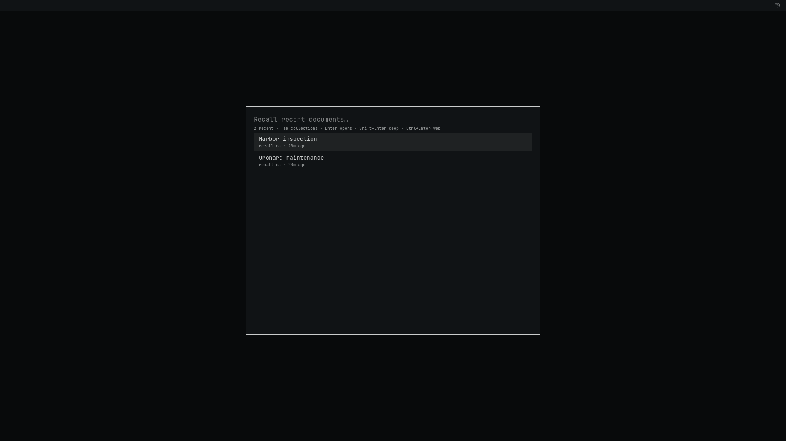
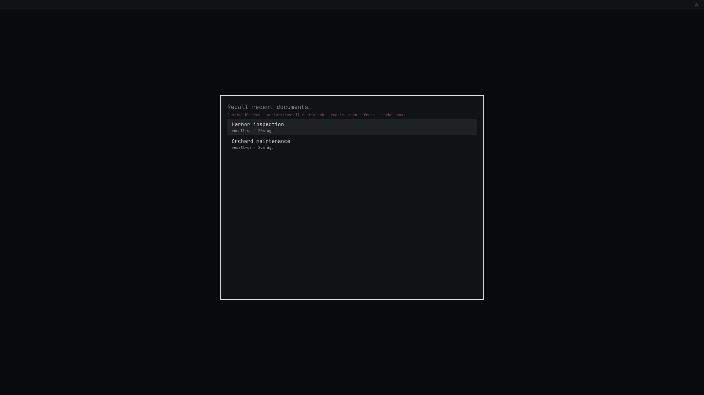

# Verified-runtime validation

Validated on 2026-09-12 for plugin 1.1.0, GNO 2.2.1 and Bun 1.4.2.
Runtime identity: `883ad3c33d41fd71a30ebddd` (derived from the committed trust
manifest). This report records development evidence; marketplace approval still
requires the maintainer's exact-commit review on issue #3590.

## Automated and real-runtime checks

- `python3 scripts/test-runtime.py`: 13 tests cover full-tree tampering,
  missing/extra files, ownership/modes, links, archive traversal, checksums,
  guarded source patches, repair atomicity, duplicate artifact downloads,
  exact interpreter execution and loader-environment isolation.
- `node scripts/test-service-runtime.mjs`: the real launcher error envelope is
  accepted by the QML error handler; cached data does not hide a blocked runtime.
- `node scripts/test-panel-focus.mjs`: panel dismissal releases focus before
  updating optional bar state.
- Shell syntax checks and manifest entry-point validation run in CI.
- The actual pinned installer and `python3 scripts/smoke-runtime.py` run in CI
  using an isolated runtime directory. This exercises real artifacts and native
  SQLite, beyond the unit fixtures.
- `python3 scripts/smoke-runtime.py --models-dir <existing-model-directory>`
  passed locally with fresh model metadata, synthetic indexing/embedding,
  peek/status/ls/version/search and model-backed deep query. Existing model files
  are reused as data; their cache metadata is not copied.

Observed local smoke times: indexing/embedding 5.65 s, peek/status/ls/version/search
1.43 to 1.47 s each, first-use deep query 13.25 s. These are development measurements
on this host, not latency guarantees. The installed tree contains 22,759 files
and approximately 1.3 GiB. A separate advisory cold-page-cache launch measured
2.37 s. Runtime verification remains enabled on every call.

## Native UI pass

The actual plugin QML ran inside a copy of the installed Omarchy shell using
Quickshell, with a 1920×1080 software-rendered Sway 1.12 Wayland display. The shell
copy redirected its home/config lookup to an isolated test directory; plugin
files were copied unchanged. Keyboard and pointer input used Wayland virtual
input, and screenshots used `grim`. Assertions also read the plugin's existing
IPC state and shell log.

The physical Hyprland session was locked and left untouched. Nested Hyprland
could not allocate GPU buffers, so this pass proves native QML/shell behavior on
the software Wayland compositor. It does not claim a physical Hyprland-session
check or a separate certification of every CPU/CUDA/Vulkan backend.

All documents were synthetic: “Orchard maintenance” and “Harbor inspection”.
Config and database paths were isolated. No personal collection was indexed or
modified.

| Scenario | Observed result |
|---|---|
| Open Recall | Two recent synthetic documents displayed. |
| Keyword search | `copper orchard lantern` returned Orchard maintenance. |
| First-use deep search | Fresh model metadata plus `prune the apple orchard` returned two deep hits, Orchard maintenance first. |
| Browse collections | Tab displayed the single `recall-qa` collection. |
| Browse documents | Enter displayed both documents. |
| Anchored panel | Pointer click opened the panel with two documents and one collection. |
| Close panel | Escape closed it; IPC confirmed `panelOpened=false`. |
| Runtime drift | Adding a newline to the copied runtime's package metadata caused execution refusal and `runtime-error`; the overlay displayed “Runtime blocked” and repair guidance, and the bar showed a warning. Previously verified rows remained explicitly marked as cached. |
| Repair and recovery | The real `install-runtime.sh --repair` downloaded and verified a replacement, retained the altered tree in quarantine, and restored the ready UI with two documents. |

## Findings resolved during validation

1. First model resolution printed an upstream progress spinner before JSON.
   Reproduced with fresh cache metadata. A hash-guarded backend patch disables
   that progress output; both the CLI smoke and native first-use deep search pass.
2. The verifier originally emitted a plain error while QML expected a structured
   runtime error. The launcher now returns a `RUNTIME` error envelope, covered by
   a subprocess-to-QML regression check.
3. The stale-data banner originally hid the integrity failure. Runtime errors
   now take precedence in the overlay, panel health label and bar warning.
4. Duplicate dependency URLs could race on the installer's shared download
   filename. Each exact URL/integrity pair is downloaded once and reused for its
   nested destinations; a regression check covers it.

The local correctness audit reported no additional defects. The maintainability
audit suggested compacting the generated manifest to reduce its line count;
that suggestion was declined to retain readable artifact entries for review.
No external review backend was used.

For future releases, follow [the maintainer procedure](MAINTAINING.md), including
fresh-cache deep search and the shared-index compatibility check. Validate the
clean Git export rather than a development directory containing ignored local
Flow state and test symlinks. Do not publish test runtimes or personal data.
